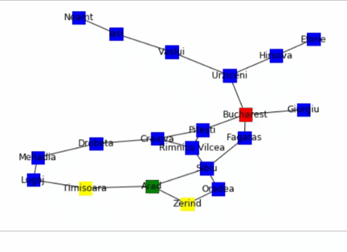
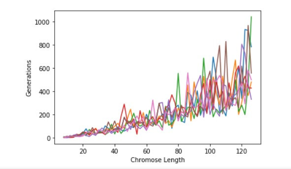
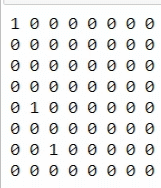

# AI - Assignments

## A1 
Following are the strategies to be implemented.
* Breadth first search
* Uniform cost search
* Greedy best first search
* Iterative deepening depth first search

A comparison of these four needs to be done. Complete list of pathway and path cost of each algorithm has to be calculated so that it shows clearly that which algorithm is best out of all in ascending order.

### Search Algorithms Sorted in order of Path Cost : 

start_node : Arad
end_node : Bucharest

1. Uniform Cost Search Path : ['Arad', 'Sibiu', 'Rimnicu Vilcea', 'Pitesti', 'Bucharest'] Cost : 418
2. Breadth First Search Path : ['Arad', 'Sibiu', 'Fagaras', 'Bucharest'] Cost : 450
3. Greedy Best First Search Path : ['Arad', 'Sibiu', 'Fagaras', 'Bucharest'] Cost : 450
4. Iterative Deepening Depth First Search Path : ['Arad', 'Sibiu', 'Fagaras', 'Bucharest'] Cost : 450

### Visualizations :
 * #### Uniform Cost Search:
    
 * #### Iterative Deepening Depth First Search:
     

Conclusions : 
 * Uniform Cost Search is Best as it is complete and optimal for edges with non uniform costs.
 * Breadth First Search and Iterative Deepening Depth First Search is only optimal for edges with uniform cost
 * Greedy Best First Search Path is not optimal.

### References : 
http://theory.stanford.edu/~amitp/GameProgramming/Heuristics.html

## A2

### Question 1: Exploring a Simple Genetic Algorithm

### Question 2: N-Queens using backtracking

### References:

https://towardsdatascience.com/introduction-to-genetic-algorithms-including-example-code-e396e98d8bf3

https://towardsdatascience.com/introduction-to-optimization-with-genetic-algorithm-2f5001d9964b

http://see.stanford.edu/materials/icspacs106b/H19-RecBacktrackExamples.pdf